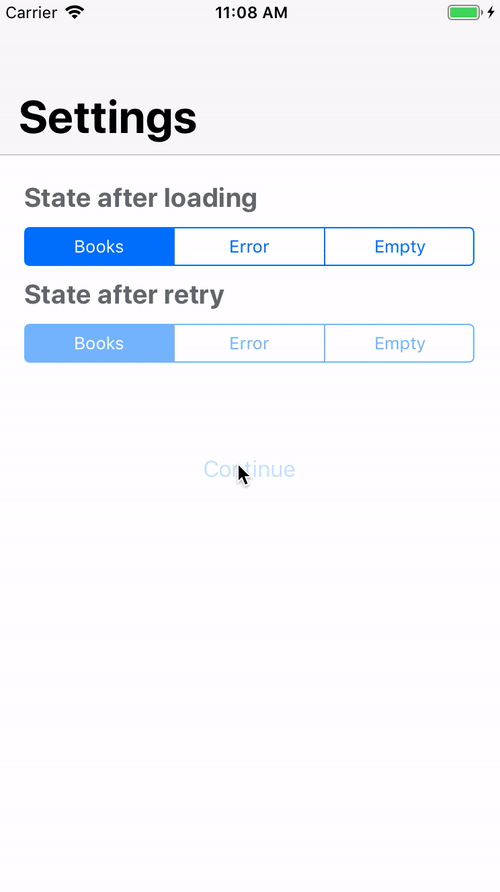

# SimpleViewControllerState

 

Example code of my post [Simple UIViewController State Machine](https://medium.com/@mario.negro.martin/simple-uiviewcontroller-state-machine-a6cd0b8ff43f). A simple state machine to show different view controllers using children view controllers.

 

 
